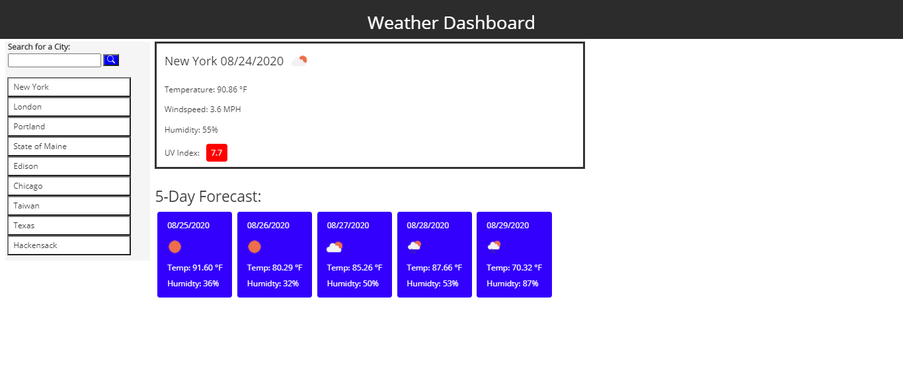

# Weather-Api-Project (WAP)
## Author & Contact Email
####  Tristan Eastman 
##### Email: teastman85@gmail.com

## License
#### [This project is licensed under the terms of the MIT license.](LICENSE)

## Table of Contents
* [Description](#description)
* [User-Story](#user-story)
* [Screenshots](#screenshots)
* [Link-to-Deployed-Website](#link)

## Description
#### WAP can help individuals see weather outlook for multiple cities and help them plan their trips accordingly. 
#### The WAP retrieves weather data for cities and utilizes local storage to store any persistent data.

## Technologies Used
* [jQuery](https://jquery.com/)
* [moment.js](https://momentjs.com/)
* [fontawesome](https://fontawesome.com/)
* [bootstrap](https://getbootstrap.com/)

## User Story
#### AS A traveler.
#### I WANT to review the weather at potential locations.
#### SO THAT I make the safest decision as to where my travels take me.

## GIF 

## Screenshot

## Link to Deployed Website
#### https://teastman201.github.io/Weather-Api-Project/

